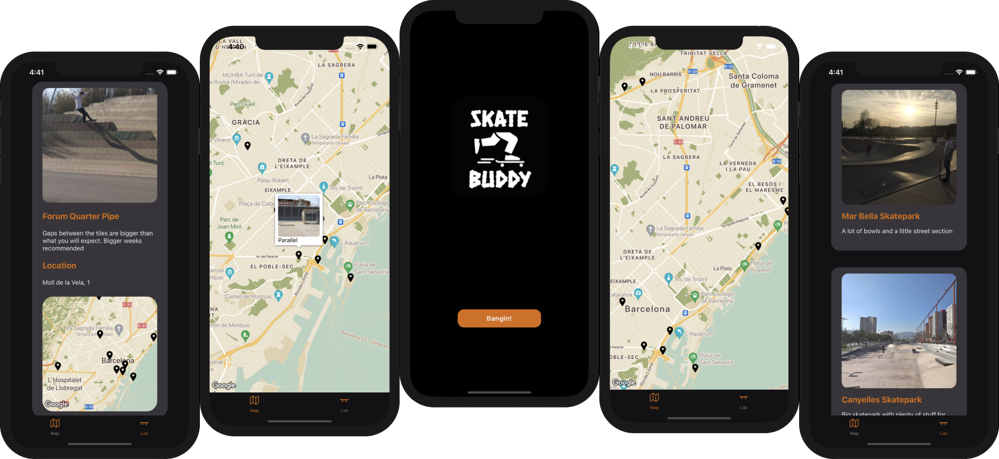

# Skate Buddy

<p align="center">

</p>

Skate Buddy is a progressive mobile app, that helps skaters finding favorite skate spots in Barcelona. You can easily search location on a Map or browse through the existing list. Once you find your desired spot, just with a simple click you are able to see its location, description, and photo.

### Future goals

- Implement Authentication and Authorization
- Ability to capture photos and upload to users profile

## Screenshots

<p align="center">

</p>

## Getting Started

1. Clone repo

```
git clone https://github.com/Jonas-Petrauskas/Skate-Buddy.git
```

2. Install dependencies in the **Cliet** and the **Server**

```
Client -> cd client -> npm install
```

```
Server -> cd server -> npm install
```

3. Start development **Client** and **Server**

```
Client -> expo start or npm start
```

```
Server -> nodemon
```

## Built with

- [Expo](https://expo.io/) - Expo is an open-source platform for making universal native apps.
- [React Native](https://reactnative.dev/) - React Native is an open-source mobile application framework used to develop applications for Android, Android TV, iOS, macOS, tvOS, Web, Windows and UWP.
- [Express.js](https://expressjs.com/) - Next generation minimal and flexible Node.js web application framework.
- [MongoDB](https://www.mongodb.com/) - MongoDB is a source-available cross-platform document-oriented database program.
- [Figma](https://www.figma.com/) - Figma is a vector graphics editor and prototyping tool.

## Developer

Jonas Petrauskas - [GitHub](https://github.com/Jonas-Petrauskas) - [LinkedIn](https://www.linkedin.com/in/jonas-petrauskas-78038894/)
